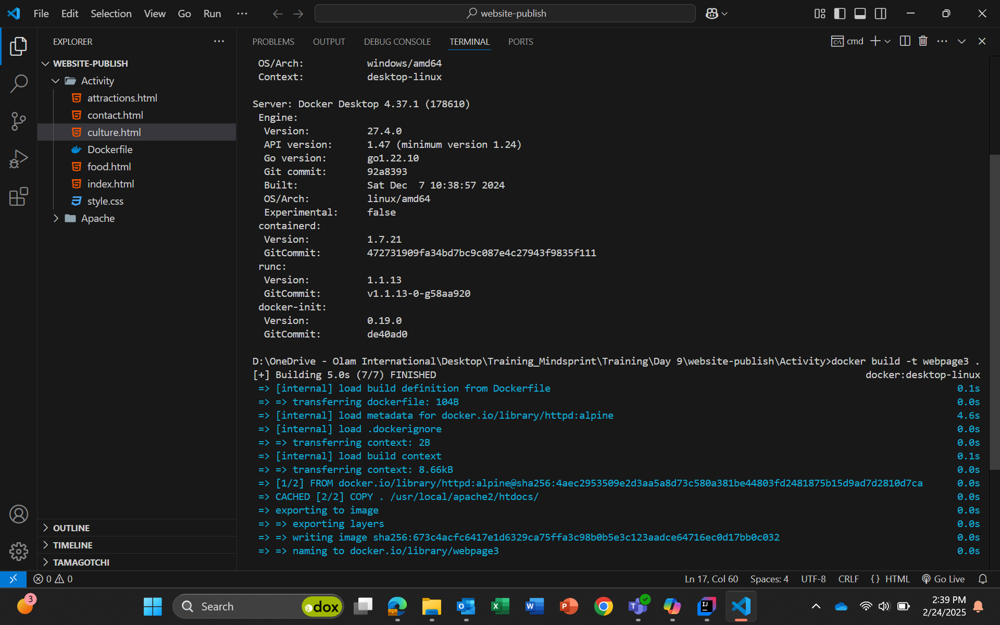
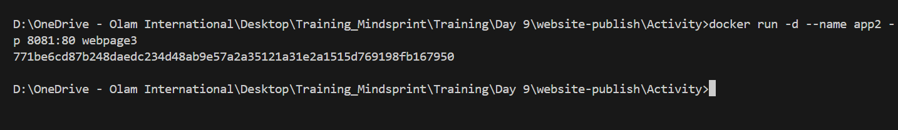
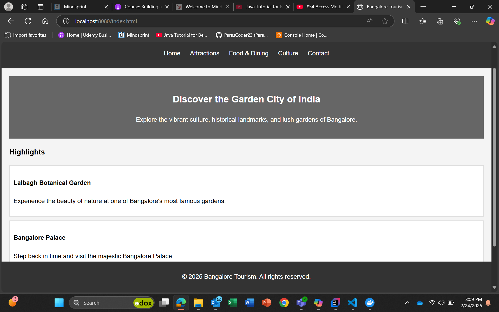
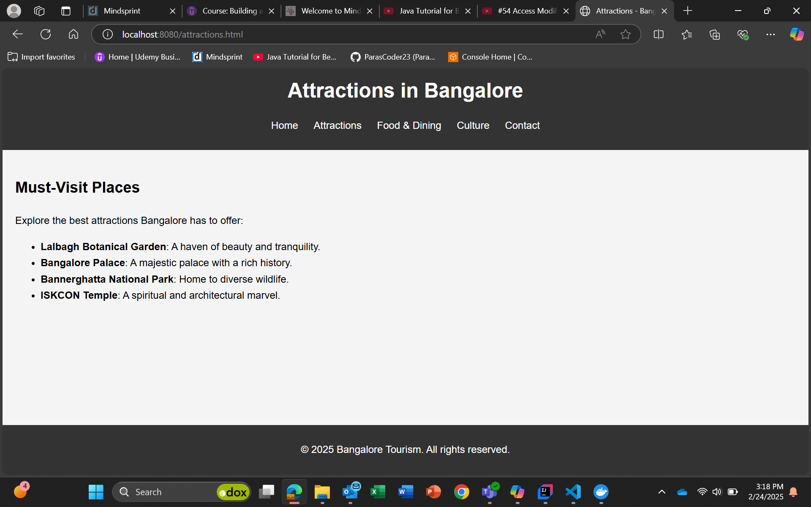
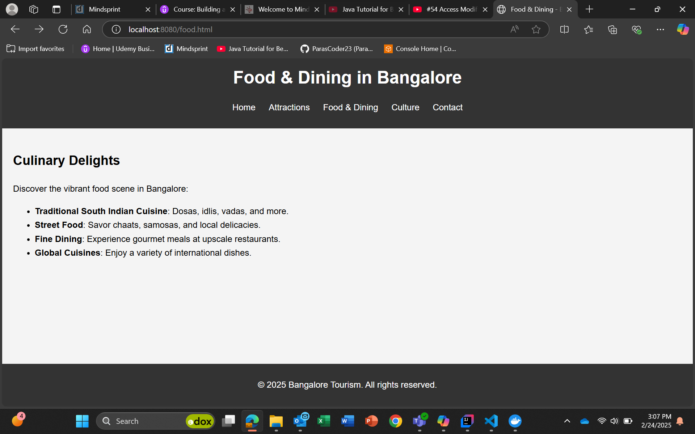
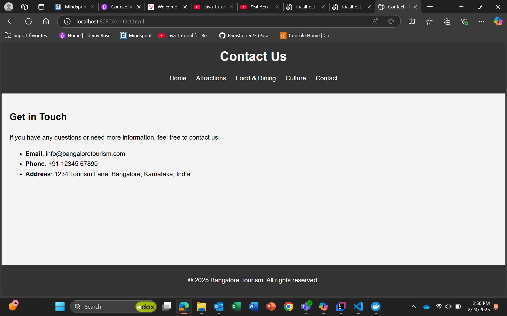

# Build Image

# Create Container

## docker run -d --name app2 -p 8080:80 webpage3

Then we can access the web site by localhost:8080/ on my PC

# Output Of Website

## Home Page

## Attractions Page

## Food and Dining

## Culture Page

## Contact Us Page

